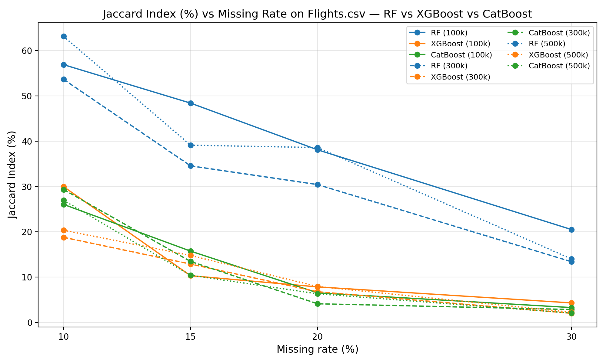
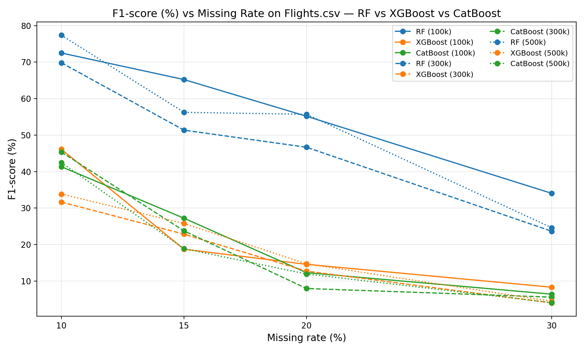
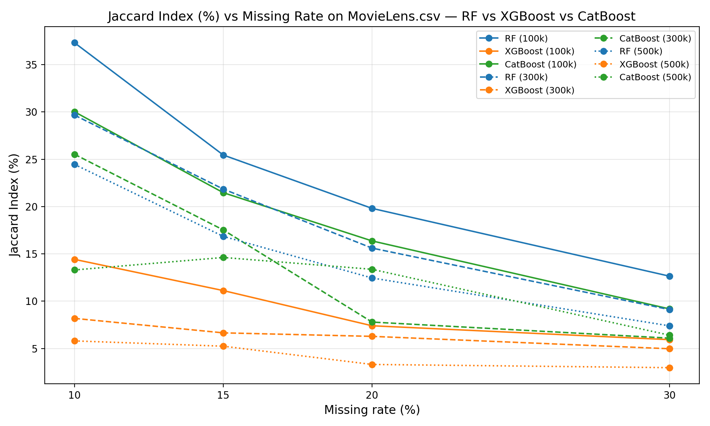
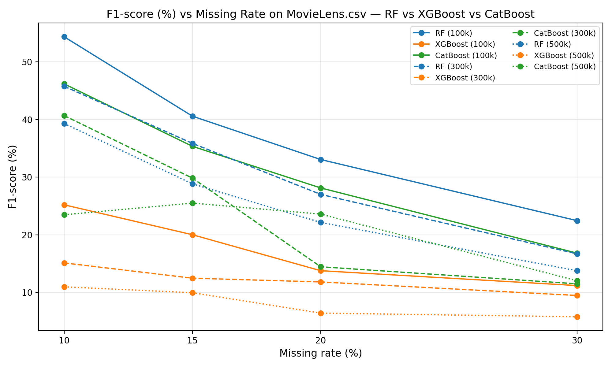

# Comparative Analysis of Imputation Models for Multidimensional Skyline Queries

This project presents a comparative analysis of missing data imputation models for multidimensional Skyline queries. Specifically, it evaluates the performance and accuracy of three machine learning–based imputation approaches — **Random Forest**, **XGBoost**, and **CatBoost** — on incomplete datasets to improve Skyline query quality and robustness.

  

## Overview
The study focuses on handling incomplete multidimensional data commonly found in real-world decision-support systems. By comparing multiple imputation models, the project aims to identify the most effective approach for preserving the dominance relationships crucial to Skyline computation.

## Technologies
- **Python** (data preprocessing, model training, evaluation)  
- **PySpark** (parallel Skyline computation – BBS-style)  
- **Pandas / Scikit-learn / Random Forest / XGBoost / CatBoost**

## Evaluation Metrics
Precision, Recall, F1-Score, and Jaccard Index are used to assess imputation performance.

## Output
- Imputed datasets: `data_{size}_miss{rate}_imputed.parquet`  
- Skyline results: `skyline_bbs_{size}_miss{rate}.parquet`

## Experimental Results

- Here is the comparison result of the three models — Random Forest, CatBoost, and XGBoost — on the Flight Delays dataset.

  

  

- Here is the comparison result of the three models — Random Forest, CatBoost, and XGBoost — on the MoviesLen dataset.

  

  

